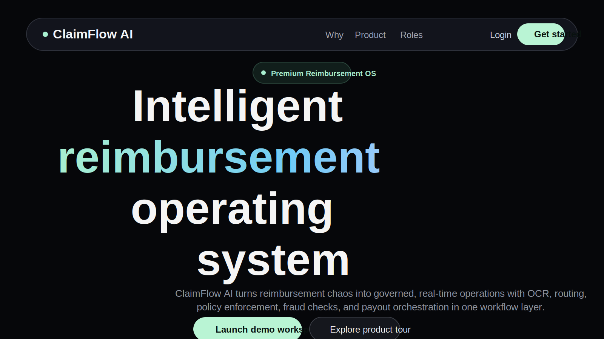
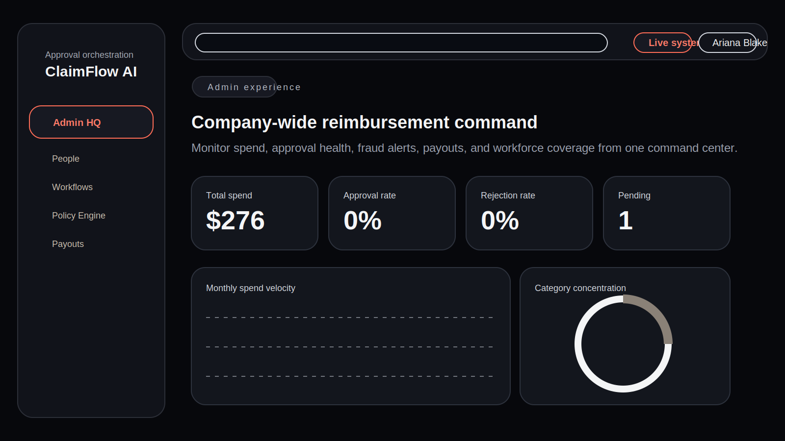
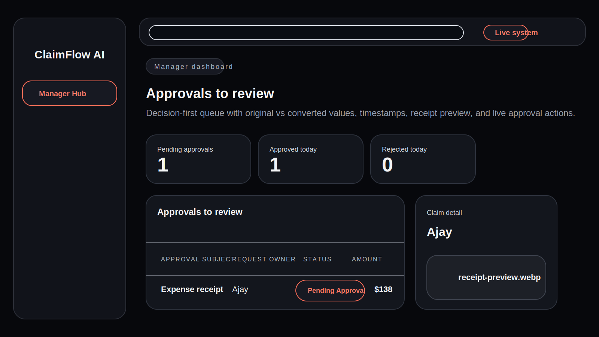
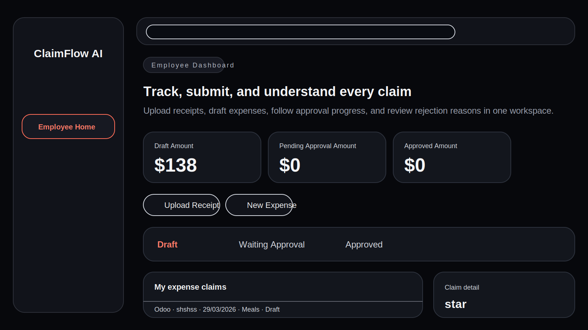
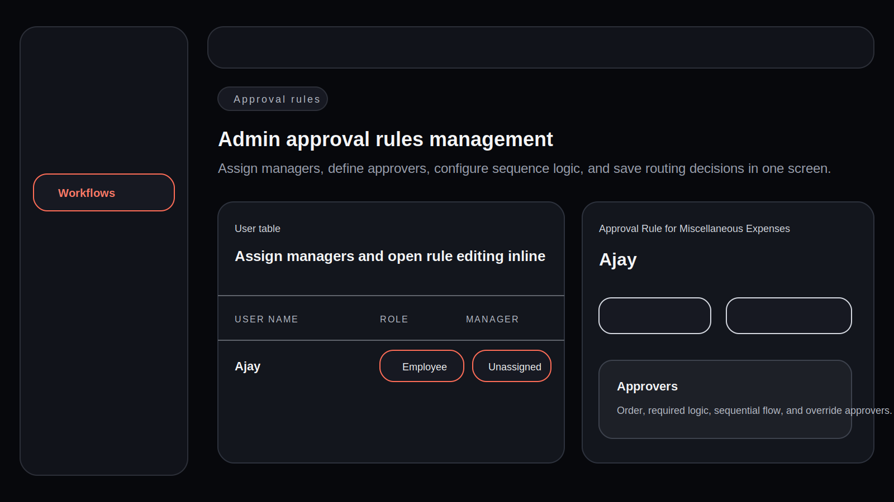

# ClaimFlow AI

ClaimFlow AI is a premium reimbursement management platform for modern finance teams. It combines receipt capture, OCR-assisted expense creation, policy validation, fraud signals, conditional approvals, notifications, audit trails, and payout tracking in a single enterprise workflow system.

<p>
  <a href="https://drive.google.com/drive/u/0/folders/1PrDnClGYbwPeKzfy19W5RwjCZ3NMtNEE">Demo Video and Product Walkthrough</a>
</p>

## Overview

ClaimFlow AI is designed around the full reimbursement lifecycle:

1. A company signs up and gets a workspace plus an initial admin account.
2. Admins create employees and managers, define reporting lines, and configure approval logic.
3. Employees upload receipts, run OCR, review extracted fields, and submit claims.
4. The platform validates policy, calculates fraud risk, and routes each claim through a live approval workflow.
5. Managers and finance reviewers approve, reject, or escalate with timestamped actions.
6. Approved claims move into payout handling and are marked paid with full audit history.

This repository contains a working Next.js full-stack implementation with Prisma persistence, local session auth, OCR integration flow, dynamic approval routing, and role-specific dashboards.

## Product Gallery

### Landing experience



### Admin command center



### Manager approval dashboard



### Employee reimbursement workspace



### Approval rules management



## Core Capabilities

### Authentication and company onboarding

- Company signup creates both the company record and the first admin user.
- Login and logout are handled with secure session cookies.
- Forgot password and reset-password flows are included.
- Employees and managers are provisioned by admins from inside the platform.
- Country and currency setup is driven by the Rest Countries API.

### Employee workspace

- Create multi-currency expense claims.
- Upload receipt images and stage OCR review before submission.
- Review extracted merchant, amount, date, tax, and category suggestions.
- Save drafts or submit into the approval workflow.
- Track claim status, timeline, rejection reasons, and payout progress.
- Use the claim-aware assistant panel for quick status questions.

### Manager workflow

- Review claims assigned through live `ApprovalRequest` records.
- See original amount and converted company amount together.
- Open receipt preview, inspect details, review risk, and check the timeline.
- Approve or reject with stored timestamps and comments.
- Process bulk approvals for eligible claims.
- Watch the dashboard refresh automatically through live polling.

### Admin controls

- Monitor company-wide reimbursement analytics.
- Create managers and employees with reporting lines, departments, and cost centers.
- Configure approval rules and workflow templates.
- Define sequential, parallel, percentage-based, and override-driven approval paths.
- View all claims, audit logs, notifications, fraud flags, and payout queues.

### Policy and risk intelligence

- Category and threshold-based policy checks.
- Soft and hard policy violations.
- Fraud flag generation and risk scoring.
- OCR confidence handling and low-confidence field review.
- Claim summaries and workflow context shown directly in review surfaces.

### Finance and payout handling

- Approved claims move into the reimbursement payment queue.
- Finance can mark claims as paid.
- Payment status is reflected back into employee and admin views.
- Audit events and notifications are created along the way.

## Feature List

### Platform

- Role-based workspaces for Admin, Manager, and Employee
- Company onboarding with base currency setup
- Session-based authentication
- Responsive premium dashboard UI
- Glass-style enterprise visual language

### Claims

- Draft and submitted claim states
- Receipt upload and storage abstraction
- OCR extraction pipeline
- Claim detail timelines
- Multi-currency conversion with stored exchange snapshots

### Approvals

- Reporting-manager approval routing
- Multi-step workflow templates
- Sequential and parallel approval modes
- Percentage-based approval thresholds
- Specific approver override logic
- Live approval status progression

### Governance

- Policy validation engine
- Fraud checks and anomaly signals
- Notification center
- Audit trail
- Payout queue management

## Tech Stack

### Frontend

- Next.js 15 App Router
- React 19
- TypeScript
- Tailwind CSS
- Framer Motion
- Recharts
- React Hook Form
- Zod
- Lucide React

### Backend

- Next.js route handlers
- Prisma ORM
- SQLite for local development
- Service-layer architecture
- Cookie-based sessions

### OCR and integrations

- OCR provider support through `OCR_API_KEY`
- Local Tesseract fallback
- Rest Countries API for country and currency discovery
- ExchangeRate API integration for live currency conversion

## Repository Structure

```text
app/
  (auth)/                 Login, signup, forgot-password flows
  api/                    Route handlers for auth, claims, approvals, finance, analytics
  app/                    Protected product surfaces for admin, manager, and employee
components/
  claims/                 Claim actions, previews, and submission controls
  dashboard/              Role-based dashboards
  layout/                 App shell, sidebar, top bar, background
  workflow/               Workflow and approval rules interfaces
lib/
  services/               Business logic for claims, approvals, workflows, analytics, policy, fraud
  auth.ts                 Session and password utilities
  db.ts                   Prisma client
  ocr.ts                  OCR integration and fallback handling
  uploads.ts              Receipt storage helpers
prisma/
  schema.prisma           Data model
  seed.ts                 Seed script
docs/
  images/                 README product visuals
```

## Database Model

The Prisma schema covers:

- Company
- User
- Role
- EmployeeProfile
- Department
- CostCenter
- ManagerRelationship
- ExpenseClaim
- ExpenseReceipt
- OCRExtraction
- ExpenseLineItem
- ApprovalWorkflowTemplate
- ApprovalWorkflowStep
- ApprovalRule
- ApprovalRequest
- ApprovalAction
- PolicyRule
- FraudFlag
- Notification
- AuditLog
- ExchangeRateSnapshot
- ReimbursementPayment

## Local Development

### Prerequisites

- Node.js 20 or later
- npm

### Clone the repository

```bash
git clone https://github.com/Monjit-Borah/FlowClaim.git
cd FlowClaim
```

### Install dependencies

```bash
npm install
```

### Environment variables

Create a local `.env` file based on `.env.example`:

```bash
cp .env.example .env
```

Recommended local values:

```env
DATABASE_URL="file:./dev.db"
APP_URL="http://localhost:3000"
SESSION_SECRET="change-me-for-real-deployments"
OCR_API_KEY=""
```

### Prepare the database

```bash
npm run prisma:generate
npm run prisma:push
npm run seed
```

### Start the application

```bash
npm run dev
```

Open:

- `http://localhost:3000`
- `http://localhost:3000/login`
- `http://localhost:3000/signup`

## Default Seed Accounts

Use these demo credentials after seeding:

- Admin: `ariana@northstar.ai`
- Manager: `marcus@northstar.ai`
- Employee: `nina@northstar.ai`
- Password for seeded users: `password123`

## Scripts

```bash
npm run dev
npm run build
npm run start
npm run seed
npm run prisma:generate
npm run prisma:push
```

## API Integrations

### Country and currency onboarding

- Endpoint: `https://restcountries.com/v3.1/all?fields=name,currencies`
- Used for company country selection and default base currency selection

### Exchange rate conversion

- Endpoint: `https://api.exchangerate-api.com/v4/latest/{BASE_CURRENCY}`
- Used to convert original expense amounts into the company base currency
- Exchange rate snapshots are stored at claim creation time

### OCR

The app supports:

- OCR provider usage through `OCR_API_KEY`
- local OCR fallback through Tesseract

Receipt processing is handled through:

- upload persistence
- OCR extraction
- extraction storage
- claim update to review state

## Approval Lifecycle

ClaimFlow AI supports:

- draft claims
- OCR processing
- ready for review
- submitted claims
- pending manager approval
- pending finance approval
- pending director approval
- pending conditional approval
- approved
- rejected
- sent back
- escalated
- in payment queue
- paid

Each approval action stores:

- actor
- action type
- timestamp
- optional comment

## Role-Based Product Surfaces

### Admin

- `/app/admin`
- `/app/admin/users`
- `/app/admin/workflows`
- `/app/admin/policies`
- `/app/admin/payouts`
- `/app/admin/analytics`

### Manager

- `/app/manager`
- `/app/manager/claims/[id]`
- `/app/manager/analytics`

### Employee

- `/app/employee`
- `/app/employee/claims/new`
- `/app/employee/claims/review`
- `/app/employee/claims/[id]`
- `/app/employee/notifications`

## Deployment Notes

For a stronger hosted production setup, replace the local defaults with:

- PostgreSQL instead of SQLite
- object storage such as S3 or Cloudinary instead of local receipt files
- a production-grade email provider for resets and notifications
- secure secrets stored through your hosting platform

The current codebase is structured so those upgrades can be introduced without rewriting the app architecture.

## Contributing

1. Fork the repository
2. Create a feature branch
3. Make your changes
4. Run `npm run build`
5. Open a pull request

## Demo and Walkthrough

- Demo folder: <https://drive.google.com/drive/u/0/folders/1PrDnClGYbwPeKzfy19W5RwjCZ3NMtNEE>

## License

This project is licensed under the MIT License. See the [LICENSE](./LICENSE) file for details.
